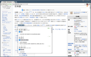
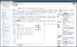

# Yomichan for Chrome #

The Yomichan extension for Chrome allows you to turn Chrome into a tool for building Japanese language literacy
(regardless of current skill level), aiding in deciphering texts which would be otherwise too difficult tackle. This
browser extension was inspired in part by [Rikaichan](https://addons.mozilla.org/en-US/firefox/addon/rikaichan/) and
[Rikaikun](https://chrome.google.com/webstore/detail/rikaikun/jipdnfibhldikgcjhfnomkfpcebammhp?hl=en), but it stands
apart in its goal of being a all-encompassing learning tool as opposed to a mere browser-based dictionary. It is the
natural evolution of the [Yomichan](/projects/yomichan) plugin that I developed for [Anki](http://ankisrs.net/) back in
2011 and the two applications can be used together in order to automatically generate flash cards for new vocabulary and
Kanji encountered during reading.

## Installation ##

The easiest way to install this extension is to download it from its listing in the [Chrome Web
Store](https://chrome.google.com/webstore/detail/yomichan/ogmnaimimemjmbakcfefmnahgdfhfami). If you are a developer, you
can also clone the [repository on GitHub](https://github.com/FooSoft/yomichan-chrome-ext), provided that you have have
installed [Git LFS](https://git-lfs.github.com/) and have initialized the included submodule dependencies after pulling
down the main project. If you wish to use this extension alongside Anki, please read and follow the installation
instructions for the [Yomichan](/projects/yomichan) plugin.

## Usage ##

1.  Click on the Yomichan browser action button in the upper right corner of the window (labeled ヨミ).
2.  Hold down the `Shift` or the middle mouse button while you move your mouse over Japanese text.
3.  Resize the definition window by dragging the bottom right corner of the window.
4.  Clicking on a Kanji will display the Kanji information page, including a Kanji stroke diagram.
5.  If you are using [AnkiConnect](/projects/yomichan), you will see buttons that can be used to create flash cards.
6.  Right click on the Yomichan browser action button and select *Options* to configure the extension.

## Screenshots ##

## License ##

GPL
