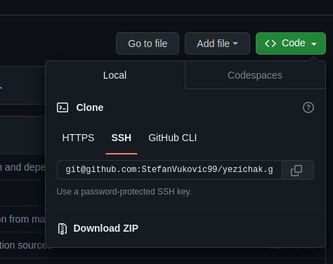
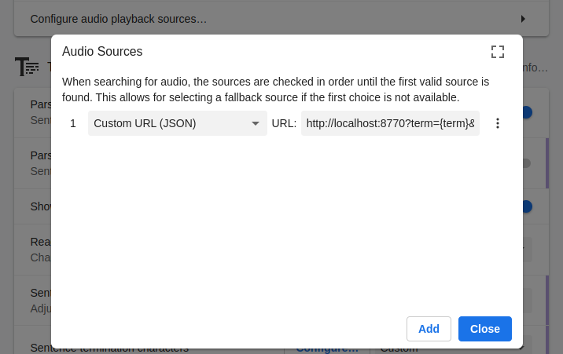

# Yezichak 👅

Yezichak is a fork of yomichan meant to work with languages other than Japanese. It turns your web browser into a tool for building language proficiency by helping you to decipher texts which would be otherwise too difficult to tackle. 

Yezichak provides advanced features not available in other browser-based dictionaries:

*   Interactive popup definition window for displaying search results.
*   On-demand audio playback for select dictionary definitions.
*   Custom search page for easily executing custom search queries.
*   Automatic note creation for the [Anki](https://apps.ankiweb.net/) flashcard program via the [AnkiConnect](https://foosoft.net/projects/anki-connect) plugin.
*   Clean, modern code makes it easy for developers to [contribute](https://github.com/FooSoft/yomichan/blob/master/CONTRIBUTING.md) new features.

## Table of Contents

*   [Installation](#installation)
    *  [Get the code](#get-the-code)
        *   [Using Git](#install-git-and-clone-the-repository-recommended)
        *   [No git](#or-download-the-zip-file)
    *   [Load the extension](#load-the-ext-folder-as-an-unpacked-extension)
*   [Dictionaries](#dictionaries)
*   [Basic Usage](#basic-usage)
    *   [Audio](#audio)
*   [Custom Dictionaries](#custom-dictionaries)
*   [Anki Integration](#anki-integration)
    *   [Flashcard Configuration](#flashcard-configuration)
    *   [Flashcard Creation](#flashcard-creation)
*   [Keyboard Shortcuts](#keyboard-shortcuts)
*   [Frequently Asked Questions](#frequently-asked-questions)
*   [Licenses](#licenses)
*   [Third-Party Libraries](#third-party-libraries)

## Installation

### Get the code

#### Install git and clone the repository (recommended)

https://www.qamadness.com/knowledge-base/how-to-install-git-and-clone-a-repository/

#### Or download the zip file
This requires less setup if you don't have git, but you won't be able to easily update the code.

### Load the ext folder as an unpacked extension
https://developer.chrome.com/docs/extensions/mv3/getstarted/development-basics/#load-unpacked

## Dictionaries

To get dictionaries, visit the #dictionaries channel in the [Yezichak Discord server](https://discord.gg/kd4YXFaV).

## Basic Usage

1.  Click the  _Yezichak_ button in the browser bar to open the quick-actions popup.

    

    *   The  _cog_ button will open the Settings page.
    *   The  _magnifying glass_ button will open the Search page.
    *   The  _question mark_ button will open the Information page.
    *   The  _profile_ button will appear when multiple profiles exist, allowing the current profile to be quickly changed.

2.  Import the dictionaries you wish to search. 
    If you do not have any dictionaries installed or enabled, Yezichak will warn you that it is not ready for use by displaying an orange exclamation mark over its icon. 
    This exclamation mark will disappear once you have installed and enabled at least one dictionary.

    

3.  Webpage text can be scanned by moving the cursor while holding a modifier key, which is <kbd>Shift</kbd>
    by default. If definitions are found for the text at the cursor position, a popup window containing term definitions
    will open. This window can be dismissed by clicking anywhere outside of it.

    
    

### Audio

The recommended setup is to use the [Yomichan Forvo Server](https://ankiweb.net/shared/info/580654285) Anki add-on, and add a *Custom Audio (JSON)* audio source with the URL `http://localhost:8770?term={term}&language={language}`.

Once a working audio source is in plance, you can click on the  _speaker_ button to hear the term pronounced by a native speaker. If an audio sample is not available, you will hear a short click instead. 

## Anki Integration

Yezichak features automatic flashcard creation for [Anki](https://apps.ankiweb.net/), a free application designed to help you
retain knowledge. This feature requires the prior installation of an Anki plugin called [AnkiConnect](https://foosoft.net/projects/anki-connect).
Check the respective project page for more information about how to set up this software.

### Flashcard Configuration

Before flashcards can be automatically created, you must configure the templates used to create notes.
If you are unfamiliar with Anki deck and model management, this would be a good time to reference the [Anki
Manual](https://docs.ankiweb.net/#/). In short, you must specify what information should be included in the
flashcards that Yezichak creates through AnkiConnect.

Flashcard fields can be configured with the following steps:

1.  Open the Yezichak options page and scroll down to the section labeled *Anki Options*.
2.  Tick the checkbox labeled *Enable Anki integration* (Anki must be running with [AnkiConnect](https://foosoft.net/projects/anki-connect) installed).
3.  Select the type of template to configure by clicking on either the *Terms* or *Kanji* tabs.
4.  Select the Anki deck and model to use for new creating new flashcards of this type.
5.  Fill the model fields with markers corresponding to the information you wish to include (several can be used at
    once). Advanced users can also configure the actual [Handlebars](https://handlebarsjs.com/) templates used to create
    the flashcard contents (this is strictly optional).

    #### Markers for Term Cards

    Marker | Description
    -------|------------
    `{expression}` | The term you are adding.
    `{audio}` | Audio sample of a native speaker's pronunciation in MP3 format (if available).
    `{clipboard-image}` | An image which is stored in the system clipboard, if present.
    `{clipboard-text}` | Text which is stored in the system clipboard, if present.
    `{cloze-body}` | Raw, inflected term as it appeared before being reduced to dictionary form by Yezichak.
    `{cloze-prefix}` | Fragment of the containing `{sentence}` starting at the beginning of `{sentence}` until the beginning of `{cloze-body}`.
    `{cloze-suffix}` | Fragment of the containing `{sentence}` starting at the end of `{cloze-body}` until the end of `{sentence}`.
    `{conjugation}` | Conjugation path from the raw inflected term to the source term.
    `{dictionary}` | Name of the dictionary from which the card is being created (unavailable in *grouped* mode).
    `{document-title}` | Title of the web page that the term appeared in.
    `{frequencies}` | Frequency information for the term.
    `{glossary}` | List of definitions for the term (output format depends on whether running in *grouped* mode).
    `{glossary-brief}` | List of definitions for the term in a more compact format.
    `{glossary-no-dictionary}` | List of definitions for the term, except the dictionary tag is omitted.
    `{part-of-speech}` | Part of speech information for the term.
    `{screenshot}` | Screenshot of the web page taken at the time the term was added.
    `{search-query}` | The full search query shown on the search page.
    `{selection-text}` | The selected text on the search page or popup.
    `{sentence}` | Sentence, quote, or phrase that the term appears in from the source content.
    `{tags}` | Grammar and usage tags providing information about the term (unavailable in *grouped* mode).
    `{url}` | Address of the web page in which the term appeared in.
    `{furigana}` | Term expressed as kanji with furigana displayed above it (e.g. <ruby>日本語<rt>にほんご</rt></ruby>).
    `{furigana-plain}` | Term expressed as kanji with furigana displayed next to it in brackets (e.g. 日本語[にほんご]).
    `{sentence-furigana}` | Sentence, quote, or phrase that the term appears in from the source content, with furigana added.
    `{pitch-accents}` | List of pitch accent downstep notations for the term.
    `{pitch-accent-graphs}` | List of pitch accent graphs for the term.
    `{pitch-accent-positions}` | List of accent downstep positions for the term as a number.
    `{reading}` | Kana reading for the term (empty for terms where the expression is the reading).

When creating your model for Yezichak, *make sure that you pick a unique field to be first*; fields that will
contain `{expression}` or `{character}` are ideal candidates for this. Anki does not allow duplicate flashcards to be
added to a deck by default; it uses the first field in the model to check for duplicates. For example, if you have `{reading}`
configured to be the first field in your model and <ruby>橋<rt>はし</rt></ruby> is already in your deck, you will not
be able to create a flashcard for <ruby>箸<rt>はし</rt></ruby> because they share the same reading.

### Flashcard Creation

Once Yezichak is configured, it becomes trivial to create new flashcards with a single click. You will see the following
icons next to term definitions:

*   Clicking  adds the current expression as a term (e.g. 食べる).
*   Clicking  adds the current expression as hiragana or katakana (e.g. たべる).

Below are some troubleshooting tips you can try if you are unable to create new flashcards:

*   Individual icons will appear grayed out if a flashcard cannot be created for the current definition (e.g. it already exists in the deck).
*   If all of the buttons appear grayed out, then you should double-check your deck and model configuration settings.
*   If no icons appear at all, make sure that Anki is running in the background and that [AnkiConnect](https://foosoft.net/projects/anki-connect) has been installed.

## Keyboard Shortcuts

The following shortcuts are globally available:

Shortcut | Action
---------|-------
<kbd>Alt</kbd> + <kbd>Insert</kbd> | Open search page.
<kbd>Alt</kbd> + <kbd>Delete</kbd> | Toggle extension on/off.

The following shortcuts are available on search results:

Shortcut | Action
---------|-------
<kbd>Esc</kbd> | Cancel current search.
<kbd>Alt</kbd> + <kbd>PgUp</kbd> | Page up through results.
<kbd>Alt</kbd> + <kbd>PgDn</kbd> | Page down through results.
<kbd>Alt</kbd> + <kbd>End</kbd> | Go to last result.
<kbd>Alt</kbd> + <kbd>Home</kbd> | Go to first result.
<kbd>Alt</kbd> + <kbd>Up</kbd> | Go to previous result.
<kbd>Alt</kbd> + <kbd>Down</kbd> | Go to next result.
<kbd>Alt</kbd> + <kbd>b</kbd> | Go to back to source term.
<kbd>Alt</kbd> + <kbd>e</kbd> | Add current term as expression to Anki.
<kbd>Alt</kbd> + <kbd>r</kbd> | Add current term as reading to Anki.
<kbd>Alt</kbd> + <kbd>p</kbd> | Play audio for current term.
<kbd>Alt</kbd> + <kbd>k</kbd> | Add current kanji to Anki.

## Frequently Asked Questions

**I'm having problems importing dictionaries in Firefox, what do I do?**

Yezichak uses the cross-browser IndexedDB system for storing imported dictionary data into your user profile. Although
everything "just works" in Chrome, depending on settings, Firefox users can run into problems due to browser bugs.
Yezichak catches errors and tries to offer suggestions about how to work around Firefox issues, but in general at least
one of the following solutions should work for you:

*   Make sure you have cookies enabled. It appears that disabling them also disables IndexedDB for some reason. You
    can still have cookies be disabled on other sites; just make sure to add the Yezichak extension to the whitelist of
    whatever tool you are using to restrict cookies. You can get the extension "URL" by looking at the address bar when
    you have the search page open.
*   Make sure that you have sufficient disk space available on the drive Firefox uses to store your user profile.
    Firefox limits the amount of space that can be used by IndexedDB to a small fraction of the disk space actually
    available on your computer.
*   Make sure that you have history set to "Remember history" enabled in your privacy settings. When this option is
    set to "Never remember history", IndexedDB access is once again disabled for an inexplicable reason.
*   As a last resort, try using the [Refresh Firefox](https://support.mozilla.org/en-US/kb/reset-preferences-fix-problems)
    feature to reset your user profile. It appears that the Firefox profile system can corrupt itself preventing
    IndexedDB from being accessible to Yezichak.

**Is it possible to use Yezichak with files saved locally on my computer with Chrome?**

In order to use Yezichak with local files in Chrome, you must first tick the *Allow access to file URLs* checkbox
for Yezichak on the extensions page. Due to the restrictions placed on browser addons in the WebExtensions model, it
will likely never be possible to use Yezichak with PDF files.

**Is it possible to delete individual dictionaries without purging the database?**

Yezichak is able to delete individual dictionaries, but keep in mind that this process can be *very* slow and can
cause the browser to become unresponsive. The time it takes to delete a single dictionary can sometimes be roughly
the same as the time it originally took to import, which can be significant for certain large dictionaries.

## Licenses

Required licensing notices for this project follow below:

*   **EDRDG License** \
    This package uses the [EDICT](https://www.edrdg.org/jmdict/edict.html) and
    [KANJIDIC](https://www.edrdg.org/wiki/index.php/KANJIDIC_Project) dictionary files. These files are the property of
    the [Electronic Dictionary Research and Development Group](https://www.edrdg.org/), and are used in conformance with
    the Group's [license](https://www.edrdg.org/edrdg/licence.html).

*   **Kanjium License** \
    The pitch accent notation, verb particle data, phonetics, homonyms and other additions or modifications to EDICT,
    KANJIDIC or KRADFILE were provided by Uros Ozvatic through his free database.

## Third-Party Libraries

Yezichak uses several third-party libraries to function. Below are links to homepages, snapshots, and licenses of the exact
versions packaged.

*   Handlebars: [homepage](https://handlebarsjs.com/) - [snapshot](https://s3.amazonaws.com/builds.handlebarsjs.com/handlebars.min-v4.7.7.js) - [license](https://github.com/handlebars-lang/handlebars.js/blob/v4.7.7/LICENSE)
*   JSZip: [homepage](https://stuk.github.io/jszip/) - [snapshot](https://github.com/Stuk/jszip/blob/v3.9.1/dist/jszip.min.js) - [license](https://github.com/Stuk/jszip/blob/v3.9.1/LICENSE.markdown)
*   WanaKana: [homepage](https://wanakana.com/) - [snapshot](https://unpkg.com/wanakana@4.0.2/umd/wanakana.min.js) - [license](https://github.com/WaniKani/WanaKana/blob/4.0.2/LICENSE)
*   parse5: [homepage](https://github.com/inikulin/parse5) - [snapshot](https://github.com/inikulin/parse5/tree/v7.1.1/packages/parse5) - [license](https://github.com/inikulin/parse5/blob/v7.1.1/LICENSE) _(Only used in MV3 build)_
