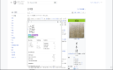
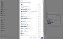
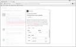

# Yomitan <!-- omit from toc --> 
[>)](https://chrome.google.com/webstore/detail/yomitan/likgccmbimhjbgkjambclfkhldnlhbnn)
[>)](https://addons.mozilla.org/en-US/firefox/addon/yomitan/)

 

:wave: **This project is a community fork of Yomichan** (which was [sunset](https://foosoft.net/posts/sunsetting-the-yomichan-project/) by its owner on Feb 26 2023). We have made a number of foundational changes to ensure **the project stays alive, works on latest browser versions, and is easy to contribute to**:

- Completed the Manifest V2 → V3 transition, [read why here!](https://developer.chrome.com/blog/resuming-the-transition-to-mv3/).
- Switched to using ECMAScript modules and npm-sourced dependencies.
- Implemented an end-to-end CI/CD pipeline.
- Switched to standard testing frameworks, vitest and playwrights.

In addition, we are beginning to make important bug fixes and minor enhancements:

- Improve dictionary import speeds by 2x~10x.
- Add functionality to import/export multiple dictionaries, enabling portability across devices.
- And [more](https://github.com/themoeway/yomitan/pulls?q=is%3Apr+is%3Amerged+-label%3Aarea%2Fdependencies+-label%3Akind%2Fmeta).

Since the owner requested forks be uniquely named, we have chosen a new name, _yomitan_. (_-tan_ is an honorific used for anthropomorphic moe characters.) While we've made some substantial changes, the majority of the extension's functionality is thanks to hard work of foosoft and numerous other open source contributors from 2016-2023.

## Contributing

Since this is a distributed effort, we **highly welcome new contributors**! Feel free to browse the [issue tracker](https://github.com/themoeway/yomitan/issues), and read our [contributing guidelines](./CONTRIBUTING.md). You can also find us on [TheMoeWay Discord](https://discord.gg/UGNPMDE7zC) at [#yomitan-development](https://discord.com/channels/617136488840429598/1081538711742844980).

## What's Yomitan?<!-- omit from toc -->

Yomitan turns your web browser into a tool for building Japanese language literacy by helping you to decipher texts
which would be otherwise too difficult tackle. This extension is similar to [10ten Japanese Reader (formerly Rikaichamp)](https://addons.mozilla.org/en-US/firefox/addon/10ten-ja-reader/) for Firefox and [Rikaikun](https://chrome.google.com/webstore/detail/rikaikun/jipdnfibhldikgcjhfnomkfpcebammhp?hl=en) for Chrome, but it stands apart in its goal of being an all-encompassing learning tool as opposed to a mere browser-based dictionary.

Yomitan provides advanced features not available in other browser-based dictionaries:

- Interactive popup definition window for displaying search results.
- On-demand audio playback for select dictionary definitions.
- Kanji stroke order diagrams are just a click away for most characters.
- Custom search page for easily executing custom search queries.
- Support for multiple dictionary formats including [EPWING](https://ja.wikipedia.org/wiki/EPWING) via the [Yomitan Import](https://github.com/themoeway/yomitan-import) tool.
- Automatic note creation for the [Anki](https://apps.ankiweb.net/) flashcard program via the [AnkiConnect](https://foosoft.net/projects/anki-connect) plugin.
- Clean, modern code makes it easy for developers to [contribute](https://github.com/themoeway/yomitan/blob/master/CONTRIBUTING.md) new features.

## Helpful information<!-- omit from toc -->

- [Migrating from Yomichan (legacy)](./docs/yomichan-migration.md#migrating-from-yomichan)
- [Importing standardised and custom dictionaries](./docs/dictionaries.md#dictionaries)
- [Anki integration and flashcards creation](./docs/anki-integration.md#anki-integration)
- [Advanced options, including MeCab](./docs/advanced-options.md#advanced-options)
- [Frequently asked questions](./docs/faq.md#frequently-asked-questions)
- [Keyboard shortcuts](./docs/keyboard-shortcuts.md)

## Installation

Yomitan comes in two flavors: _stable_ and _testing_. New changes are initially introduced into the _testing_ version, and after some time spent ensuring that they are relatively bug free, they will be promoted to the _stable_ version. If you are technically savvy and don't mind submitting issues on GitHub, try the _testing_ version; otherwise, the _stable_ version will be your best bet.

- **Google Chrome**
  - [stable](https://chrome.google.com/webstore/detail/yomitan/likgccmbimhjbgkjambclfkhldnlhbnn)
  - [testing](https://chrome.google.com/webstore/detail/yomitan-development-build/glnaenfapkkecknnmginabpmgkenenml)

- **Mozilla Firefox**
  - [stable](https://addons.mozilla.org/en-US/firefox/addon/yomitan/)
  - [testing](https://github.com/themoeway/yomitan/releases) ※

※ Unlike Chrome, Firefox does not allow extensions meant for testing to be hosted in the marketplace.
You will have to download a desired version and side-load it yourself. You only need to do this once and will get
updates automatically.

## Basic Usage

1.  Click the  _Yomitan_ button in the browser bar to open the quick-actions popup.

    

    - The  _cog_ button will open the Settings page.
    - The  _magnifying glass_ button will open the Search page.
    - The  _question mark_ button will open the Information page.
    - The  _profile_ button will appear when multiple profiles exist, allowing the current profile to be quickly changed.

2.  Import the dictionaries you wish to use for term and kanji searches, head over to the [the dictionary docs](./docs/dictionaries.md) to get set up! If you do not have any dictionaries installed or enabled, Yomitan will warn you that it is not ready for use by displaying an orange exclamation mark over its icon. This exclamation mark will disappear once you have installed and enabled at least one dictionary.

    

3.  Webpage text can be scanned by moving the cursor while holding a modifier key, which is <kbd>Shift</kbd> by default. If definitions are found for the text at the cursor position, a popup window containing term definitions will open. This window can be dismissed by clicking anywhere outside of it.

    

4.  Click on the  _speaker_ button to hear the term pronounced by a native speaker. If an audio sample is not available, you will hear a short click instead. You can configure the sources used to retrieve audio samples in the options page.

5.  Click on individual kanji in the term definition results to view additional information about those characters, including stroke order diagrams, readings, meanings, as well as other useful data.

    

To further enhance your Yomitan experience, it's worth [integrating with Anki](./docs/anki-integration.md), a spaced-repetition flashcard program to help solidify the words you encounter.

## Licenses

Required licensing notices for this project follow below:

- **EDRDG License** \
  This package uses the [EDICT](https://www.edrdg.org/jmdict/edict.html) and
  [KANJIDIC](https://www.edrdg.org/wiki/index.php/KANJIDIC_Project) dictionary files. These files are the property of
  the [Electronic Dictionary Research and Development Group](https://www.edrdg.org/), and are used in conformance with
  the Group's [license](https://www.edrdg.org/edrdg/licence.html).

- **Kanjium License** \
  The pitch accent notation, verb particle data, phonetics, homonyms and other additions or modifications to EDICT,
  KANJIDIC or KRADFILE were provided by Uros Ozvatic through his free database.

## Third-Party Libraries

Yomitan uses several third-party libraries to function.

| Name                | Installed version | License type | Link                                                     |
| :------------------ | :---------------- | :----------- | :------------------------------------------------------- |
| @zip.js/zip.js      | 2.7.31            | BSD-3-Clause | git+https://github.com/gildas-lormeau/zip.js.git         |
| dexie               | 3.2.4             | Apache-2.0   | git+https://github.com/dfahlander/Dexie.js.git           |
| dexie-export-import | 4.0.7             | Apache-2.0   | git+https://github.com/dexie/Dexie.js.git                |
| handlebars          | 4.7.8             | MIT          | git+https://github.com/handlebars-lang/handlebars.js.git |
| parse5              | 7.1.2             | MIT          | git://github.com/inikulin/parse5.git                     |
| wanakana            | 5.3.1             | MIT          | git+ssh://git@github.com/WaniKani/WanaKana.git           |
