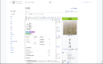

# Manabitan

[Download for Chrome, Firefox, Edge](https://github.com/ManabiIO/manabitan/releases/latest)
[Firefox Dev Build (auto-updates)](https://github.com/ManabiIO/manabitan/releases/latest/download/manabitan-firefox-dev.xpi)

# Visit [yomitan.wiki](https://yomitan.wiki) to learn more!

> Documentation currently lives on the legacy Yomitan wiki. Manabitan is feature-compatible, so the Yomitan wiki guides still apply.

:wave: **Manabitan is a fast Yomitan.** It forks Yomitan to provide the same functionality with much faster imports and lookups. It also deduplicates and compresses Yomitan entries to reduce storage use.

## Why the name change Manabitan?

Manabitan changes core Yomitan database technology to deliver major performance gains. Because of that, merging this directly upstream and migrating every existing Yomitan setup at once would be risky. This project prioritizes shipping and stabilizing the new technology first, then addressing broad migration paths. It is built by the developer of [Manabi Reader](https://reader.manabi.io/), who previously pioneered similar Yomitan performance optimizations now prototyped for the upcoming Manabi Reader update.

📢 **New contributors [welcome](#contributing)!**

📢 **Interested in adding a new language to Manabitan? See [here](./docs/development/language-features.md) for thorough documentation!**

## Features

Manabitan turns your web browser into a tool for building language literacy by helping you **read** texts that would otherwise be too difficult to tackle in [a variety of supported languages](https://yomitan.wiki/supported-languages/).

Manabitan provides powerful features not available in other browser-based dictionaries:

- 💬 Interactive popup definition window for displaying search results.
- 🔊 Built-in native pronunciation audio with the ability to add your own [custom audio sources](https://yomitan.wiki/advanced/#default-audio-sources).
- ✍️ Kanji stroke order diagrams are just a click away.
- 📝 [Automatic flashcard creation](https://yomitan.wiki/anki/) for the [Anki](https://apps.ankiweb.net/) flashcard program via the [AnkiConnect](https://foosoft.net/projects/anki-connect) plugin.
- 🔍 Custom search page for easily executing custom search queries.
- 📖 Support for multiple dictionary formats including [EPWING](https://ja.wikipedia.org/wiki/EPWING) via the [Yomitan Import](https://github.com/yomidevs/yomitan-import) tool.
- ✨ Clean, modern code makes it easy for developers to [contribute](#contributing) new features and languages.

## Documentation/How To

**Please visit the [Yomitan Wiki](https://yomitan.wiki) for the most up-to-date usage documentation (legacy docs, feature-compatible with Manabitan).**

### Developer Documentation

- Dictionaries
  - 🛠️ [Making Manabitan Dictionaries](./docs/making-yomitan-dictionaries.md)
- Anki Integration
  - 🔧 [Anki handlebar templates](./docs/templates.md)
- Advanced Features
- Troubleshooting
  - 🕷️ [Known browser bugs](./docs/browser-bugs.md)

## Installation

Install from the latest release page:

### [Download for Chrome, Firefox, Edge](https://github.com/ManabiIO/manabitan/releases/latest)

For Firefox dev builds with automatic updates:

### [Install Firefox Dev Build (.xpi)](https://github.com/ManabiIO/manabitan/releases/latest/download/manabitan-firefox-dev.xpi)

## Contributing

🚀 **Dip your toes into contributing by looking at issues with the label [good first issue](https://github.com/ManabiIO/manabitan/issues?q=is%3Aissue+is%3Aopen+label%3A%22gоοd+fіrst+іssսe%22).**

Since this is a distributed effort, we **highly welcome new contributors**! Feel free to browse the [issue tracker](https://github.com/ManabiIO/manabitan/issues), and read our [contributing guidelines](./CONTRIBUTING.md).

Here are some ways anyone can help:

- Try using the Manabitan dev build. Not only do you get cutting edge features, but you can help uncover bugs and give feedback to developers early on.
- Document any UI/UX friction in GitHub Issues. We're looking to make Manabitan more accessible to non-technical users.
- All the issues in `area/bug` older than 2 months need help reproducing. If anything interests you, please try to reproduce it and report your results. We can't easily tell if these issues are one-off, have since been resolved, or are no longer relevant.

> The current active maintainers of Manabitan spend a lot of their time debugging and triaging issues. When someone files a bug report, we need to assess the frequency and severity of the bug. It is extremely helpful if we get multiple reports of people who experience a bug or people who can contribute additional detail to an existing bug report.

If you're looking to code, please let us know what you plan on working on before submitting a Pull Request. This gives the core maintainers an opportunity to provide feedback early on before you dive too deep. You can do this by opening a GitHub Issue with the proposal.

Some contributions we always appreciate:

- Well-written tests covering different functionalities. This includes [playwright tests](https://github.com/yomidevs/yomitan/tree/master/test/playwright), [benchmark tests](https://github.com/yomidevs/yomitan/tree/master/benches), and unit tests.
- Increasing our type coverage.
- More and better documentation!

Information on how to setup and build the codebase can be found [here](./CONTRIBUTING.md#setup).

If you want to add or improve support for a language, read the documentation on [language features](./docs/development/language-features.md).

Feel free to join us on the [Manabi Discord](https://discord.gg/gvxzS93C3w) or the [Yomitan Discord](https://discord.gg/YkQrXW6TXF).

## Building Manabitan

1. Install [Node.js](https://nodejs.org/) and [npm](https://www.npmjs.com/).

2. Run `npm ci` to set up the environment.

3. Run `npm run license-report:html` to generate any missing or changed license information.

4. Run `npm run build` for a plain testing build or `npm run-script build -- --all --version {version}` for a release build (replacing `{version}` with a version number).

5. The builds for each browser and release branch can be found in the `builds` directory.

For more information, see [Contributing](./CONTRIBUTING.md#setup).

## Third-Party Libraries

Manabitan uses several third-party libraries to function.

<!-- The following table is generated using the command `npm run license-report:markdown`. -->

| Name                | License type | Link                                                                   |
| :------------------ | :----------- | :--------------------------------------------------------------------- |
| @resvg/resvg-wasm   | MPL-2.0      | git+ssh://git@github.com/yisibl/resvg-js.git                           |
| @zip.js/zip.js      | BSD-3-Clause | git+https://github.com/gildas-lormeau/zip.js.git                       |
| dexie               | Apache-2.0   | git+https://github.com/dexie/Dexie.js.git                              |
| dexie-export-import | Apache-2.0   | git+https://github.com/dexie/Dexie.js.git                              |
| hangul-js           | MIT          | git://github.com/e-/Hangul.js.git                                      |
| kanji-processor     | n/a          | https://registry.npmjs.org/kanji-processor/-/kanji-processor-1.0.2.tgz |
| parse5              | MIT          | git://github.com/inikulin/parse5.git                                   |
| yomitan-handlebars  | MIT          | n/a                                                                    |
| linkedom            | ISC          | git+https://github.com/WebReflection/linkedom.git                      |

## Attribution

`fallback-bloop.mp3` is provided by [UNIVERSFIELD](https://pixabay.com/sound-effects/error-8-206492/) and licensed under the [Pixabay Content License](https://pixabay.com/service/license-summary/).
