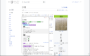
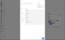

# Yomitan <!-- omit from toc -->

[>)](https://chrome.google.com/webstore/detail/yomitan-development-build/glnaenfapkkecknnmginabpmgkenenml)
[>)](https://github.com/themoeway/yomitan/releases)

\
**Important note:** Yomitan is still not recommended for use, as we are still trying to complete the transition to Manifest V3 (which is required of all new browser extensions), and there are [some critical bugs remaining](https://github.com/themoeway/yomitan/issues?q=is%3Aopen+is%3Aissue+label%3Apriority%2Fhigh). This is also why there is no stable release of yomitan yet.

> :wave: **This project is a community fork of yomichan** (which was [sunset](https://foosoft.net/posts/sunsetting-the-yomichan-project/) by its owner on Feb 26 2023).
>
> The primary goal is to **keep the project alive and working on latest browser versions and doing bugfixes**. (Feature improvements are considered secondary.)
>
> Since the owner requested forks be uniquely named, we have chosen a new name: _yomitan_. (_-tan_ is an honorific used for anthropomorphic moe characters.) While we've renamed the codebase and made judicious use of find-and-replace, it is entirely the hard work of foosoft and numerous other open source contributors from 2016-2023 and we do not claim any credit.
>
> Since this is a distributed effort, we highly welcome new contributors! Feel free to browse the issue tracker, and you can find us on [TheMoeWay Discord](https://discord.gg/UGNPMDE7zC) at [#yomitan](https://discord.com/channels/617136488840429598/1081538711742844980)

Yomitan turns your web browser into a tool for building Japanese language literacy by helping you to decipher texts
which would be otherwise too difficult tackle. This extension is similar to
[10ten Japanese Reader (formerly Rikaichamp)](https://addons.mozilla.org/en-US/firefox/addon/10ten-ja-reader/) for Firefox and
[Rikaikun](https://chrome.google.com/webstore/detail/rikaikun/jipdnfibhldikgcjhfnomkfpcebammhp?hl=en) for Chrome, but it
stands apart in its goal of being an all-encompassing learning tool as opposed to a mere browser-based dictionary.

Yomitan provides advanced features not available in other browser-based dictionaries:

- Interactive popup definition window for displaying search results.
- On-demand audio playback for select dictionary definitions.
- Kanji stroke order diagrams are just a click away for most characters.
- Custom search page for easily executing custom search queries.
- Support for multiple dictionary formats including [EPWING](https://ja.wikipedia.org/wiki/EPWING) via the [Yomichan Import](https://foosoft.net/projects/yomichan-import) tool.
- Automatic note creation for the [Anki](https://apps.ankiweb.net/) flashcard program via the [AnkiConnect](https://foosoft.net/projects/anki-connect) plugin.
- Clean, modern code makes it easy for developers to [contribute](https://github.com/themoeway/yomitan/blob/master/CONTRIBUTING.md) new features.

## Table of Contents<!-- omit from toc -->

- [Installation](#installation)
- [Migrating from Yomichan](#migrating-from-yomichan)
  - [Exporting Data](#exporting-data)
  - [Custom Templates](#custom-templates)
- [Dictionaries](#dictionaries)
- [Basic Usage](#basic-usage)
  - [Importing Dictionaries](#importing-dictionaries)
  - [Importing and Exporting Personal Configuration](#importing-and-exporting-personal-configuration)
- [Custom Dictionaries](#custom-dictionaries)
- [Anki Integration](#anki-integration)
  - [Flashcard Configuration](#flashcard-configuration)
  - [Flashcard Creation](#flashcard-creation)
- [Keyboard Shortcuts](#keyboard-shortcuts)
- [Frequently Asked Questions](#frequently-asked-questions)
- [Licenses](#licenses)
- [Third-Party Libraries](#third-party-libraries)

## Installation

Yomitan comes in two flavors: _stable_ and _testing_. Over the years, this extension has evolved to contain many
complex features which have become increasingly difficult to test across different browsers, versions, and environments.
New changes are initially introduced into the _testing_ version, and after some time spent ensuring that they are
relatively bug free, they will be promoted to the _stable_ version. If you are technically savvy and don't mind
submitting issues on GitHub, try the _testing_ version; otherwise, the _stable_ version will be your best bet.

- **Google Chrome**

  - stable (not released yet)
  - [testing](https://chrome.google.com/webstore/detail/yomitan-development-build/glnaenfapkkecknnmginabpmgkenenml)

- **Mozilla Firefox**
  - stable (not released yet)
  - [testing](https://github.com/themoeway/yomitan/releases) ※

※ NOTE: Unlike Chrome, Firefox does not allow extensions meant for testing to be hosted in the marketplace.
You will have to download a desired version and side-load it yourself. You only need to do this once and will get
updates automatically.

## Migrating from Yomichan

### Exporting Data

If you are an existing user of Yomichan, you can export your dictionary collection and settings such that they can be imported into Yomitan to reflect your setup exactly as it was.

You can export your settings from Yomichan's Settings page. Go to the `Backup` section and click on `Export Settings`.

Yomichan doesn't have first-class support to export the dictionary collection. Please follow the instructions provided in the following link to export your data:
https://github.com/themoeway/yomichan-data-exporter#steps-to-export-the-data

You can then import the exported files into Yomitan from the `Backup` section of the `Settings` page. Please see [the section on importing dictionaries](#importing-dictionaries) further below for more explicit steps.

### Custom Templates

If you do not use custom templates for Anki note creation, this section can be skipped.

Due to security concerns, an alternate implementation of Handlebars is being used which behaves slightly differently.
This revealed a bug in four of Yomitan's template helpers, which have now been fixed in the default templates. If your
custom templates use the following helpers, please ensure their use matches the corrected forms.

| Helper           | Example                                                       | Corrected                            |
| ---------------- | ------------------------------------------------------------- | ------------------------------------ |
| `formatGlossary` | `{{#formatGlossary ../dictionary}}{{{.}}}{{/formatGlossary}}` | `{{formatGlossary ../dictionary .}}` |
| `furigana`       | `{{#furigana}}{{{definition}}}{{/furigana}}`                  | `{{furigana definition}}`            |
| `furiganaPlain`  | `{{~#furiganaPlain}}{{{.}}}{{/furiganaPlain~}}`               | `{{~furiganaPlain .~}}`              |
| `dumpObject`     | `{{#dumpObject}}{{{.}}}{{/dumpObject}}`                       | `{{dumpObject .}}`                   |

Authors of custom templates may be interested to know that other helpers previously used and documented in the block
form (e.g. `{{#set "key" "value"}}{{/set}}`), while not broken by this change, may also be replaced with the less verbose
form (e.g. `{{set "key" "value"}}`). The default templates and helper documentation have been changed to reflect this.

## Dictionaries

There are several free Japanese dictionaries available for Yomitan, with two of them having glossaries available in
different languages. You must download and import the dictionaries you wish to use in order to enable Yomitan
definition lookups. If you have proprietary EPWING dictionaries that you would like to use, check the [Yomichan
Import](https://foosoft.net/projects/yomichan-import) page to learn how to convert and import them into Yomitan.

Be aware that non-English dictionaries contain fewer entries than their English counterparts. Even if your primary
language is not English, you may consider also importing the English version for better coverage.

- [Jitendex](https://github.com/stephenmk/Jitendex) - Jitendex is an improved version of JMdict for Yomitan. It features better formatting and some other improvements, and is actively being improved by its author.
- [JMdict](https://github.com/themoeway/jmdict-yomitan#jmdict-for-yomitan-1) - There are daily automatically updated builds of JMdict for Yomitan available in this repository. It is available in multiple languages and formats, but we recommend installing the more modern Jitendex for English users.
- [JMnedict](https://github.com/themoeway/jmdict-yomitan#jmnedict-for-yomitan) - JMnedict is a dictionary that lists readings of person/place/organization names and other proper nouns.
- [KANJIDIC](https://github.com/themoeway/jmdict-yomitan#kanjidic-for-yomitan) - KANJIDIC is an English dictionary listing readings, meanings, and other info about kanji characters.

## Basic Usage

1.  Click the  _Yomitan_ button in the browser bar to open the quick-actions popup.

    

    - The  _cog_ button will open the Settings page.
    - The  _magnifying glass_ button will open the Search page.
    - The  _question mark_ button will open the Information page.
    - The  _profile_ button will appear when multiple profiles exist, allowing the current profile to be quickly changed.

2.  Import the dictionaries you wish to use for term and kanji searches. If you do not have any dictionaries installed
    or enabled, Yomitan will warn you that it is not ready for use by displaying an orange exclamation mark over its
    icon. This exclamation mark will disappear once you have installed and enabled at least one dictionary.

    

3.  Webpage text can be scanned by moving the cursor while holding a modifier key, which is <kbd>Shift</kbd>
    by default. If definitions are found for the text at the cursor position, a popup window containing term definitions
    will open. This window can be dismissed by clicking anywhere outside of it.

    

4.  Click on the  _speaker_ button to hear the term pronounced by a native speaker. If an audio sample is
    not available, you will hear a short click instead. You can configure the sources used to retrieve audio samples in
    the options page.

5.  Click on individual kanji in the term definition results to view additional information about those characters,
    including stroke order diagrams, readings, meanings, as well as other useful data.

    

### Importing Dictionaries

You can import individual dictionaries from the settings page as described above.

Yomitan also supports exporting and importing your entire collection of dictionaries.

#### Importing a Dictionary Collection

- Go to Yomitan's Settings page (Click on the extension's icon then click on the cog icon from the popup)
- Click `Import Dictionary Collection` and select the database file you want to import
- Wait for the import to finish then turn all the dictionaries back on from the `Dictionaries > Configure installed and enabled dictionaries` section
- Refresh the browser tab to see the dictionaries in effect

#### Exporting the Dictionary Collection

- Click `Export Dictionary Collection` from the backup section of Yomitan's settings page
- It will show you a progress report as it exports the data then initiates a
  download for a file named something like `yomitan-dictionaries-YYYY-MM-DD-HH-mm-ss.json`
  (e.g. `yomitan-dictionaries-2023-07-05-02-42-04.json`)

### Importing and Exporting Personal Configuration

Note that you can also similarly export and import your Yomitan settings from the `Backup` section of the Settings page.

You should be able to replicate your exact Yomitan setup across devices by exporting your settings and dictionary collection from the source device then importing those from the destination.

## Custom Dictionaries

Yomitan supports the use of custom dictionaries, including the esoteric but popular
[EPWING](https://ja.wikipedia.org/wiki/EPWING) format. They were often utilized in portable electronic dictionaries
similar to the ones pictured below. These dictionaries are often sought after by language learners for their correctness
and excellent coverage of the Japanese language.

Unfortunately, as most of the dictionaries released in this format are proprietary, they are unable to be bundled with
Yomitan. Instead, you will need to procure these dictionaries yourself and import them using [Yomichan
Import](https://foosoft.net/projects/yomichan-import). Check the project page for additional details.

## Anki Integration

Yomitan features automatic flashcard creation for [Anki](https://apps.ankiweb.net/), a free application designed to help you
retain knowledge. This feature requires the prior installation of an Anki plugin called [AnkiConnect](https://foosoft.net/projects/anki-connect).
Check the respective project page for more information about how to set up this software.

### Flashcard Configuration

Before flashcards can be automatically created, you must configure the templates used to create term and/or kanji notes.
If you are unfamiliar with Anki deck and model management, this would be a good time to reference the [Anki
Manual](https://docs.ankiweb.net/#/). In short, you must specify what information should be included in the
flashcards that Yomitan creates through AnkiConnect.

Flashcard fields can be configured with the following steps:

1.  Open the Yomitan options page and scroll down to the section labeled _Anki Options_.
2.  Tick the checkbox labeled _Enable Anki integration_ (Anki must be running with [AnkiConnect](https://foosoft.net/projects/anki-connect) installed).
3.  Select the type of template to configure by clicking on either the _Terms_ or _Kanji_ tabs.
4.  Select the Anki deck and model to use for new creating new flashcards of this type.
5.  Fill the model fields with markers corresponding to the information you wish to include (several can be used at
    once). Advanced users can also configure the actual [Handlebars](https://handlebarsjs.com/) templates used to create
    the flashcard contents (this is strictly optional).

    #### Markers for Term Cards

    | Marker                     | Description                                                                                                              |
    | -------------------------- | ------------------------------------------------------------------------------------------------------------------------ |
    | `{audio}`                  | Audio sample of a native speaker's pronunciation in MP3 format (if available).                                           |
    | `{clipboard-image}`        | An image which is stored in the system clipboard, if present.                                                            |
    | `{clipboard-text}`         | Text which is stored in the system clipboard, if present.                                                                |
    | `{cloze-body}`             | Raw, inflected term as it appeared before being reduced to dictionary form by Yomitan.                                   |
    | `{cloze-prefix}`           | Fragment of the containing `{sentence}` starting at the beginning of `{sentence}` until the beginning of `{cloze-body}`. |
    | `{cloze-suffix}`           | Fragment of the containing `{sentence}` starting at the end of `{cloze-body}` until the end of `{sentence}`.             |
    | `{conjugation}`            | Conjugation path from the raw inflected term to the source term.                                                         |
    | `{dictionary}`             | Name of the dictionary from which the card is being created (unavailable in _grouped_ mode).                             |
    | `{document-title}`         | Title of the web page that the term appeared in.                                                                         |
    | `{expression}`             | Term expressed as kanji (will be displayed in kana if kanji is not available).                                           |
    | `{frequencies}`            | Frequency information for the term.                                                                                      |
    | `{furigana}`               | Term expressed as kanji with furigana displayed above it (e.g. <ruby>日本語<rt>にほんご</rt></ruby>).                    |
    | `{furigana-plain}`         | Term expressed as kanji with furigana displayed next to it in brackets (e.g. 日本語[にほんご]).                          |
    | `{glossary}`               | List of definitions for the term (output format depends on whether running in _grouped_ mode).                           |
    | `{glossary-brief}`         | List of definitions for the term in a more compact format.                                                               |
    | `{glossary-no-dictionary}` | List of definitions for the term, except the dictionary tag is omitted.                                                  |
    | `{part-of-speech}`         | Part of speech information for the term.                                                                                 |
    | `{pitch-accents}`          | List of pitch accent downstep notations for the term.                                                                    |
    | `{pitch-accent-graphs}`    | List of pitch accent graphs for the term.                                                                                |
    | `{pitch-accent-positions}` | List of accent downstep positions for the term as a number.                                                              |
    | `{reading}`                | Kana reading for the term (empty for terms where the expression is the reading).                                         |
    | `{screenshot}`             | Screenshot of the web page taken at the time the term was added.                                                         |
    | `{search-query}`           | The full search query shown on the search page.                                                                          |
    | `{selection-text}`         | The selected text on the search page or popup.                                                                           |
    | `{sentence}`               | Sentence, quote, or phrase that the term appears in from the source content.                                             |
    | `{sentence-furigana}`      | Sentence, quote, or phrase that the term appears in from the source content, with furigana added.                        |
    | `{tags}`                   | Grammar and usage tags providing information about the term (unavailable in _grouped_ mode).                             |
    | `{url}`                    | Address of the web page in which the term appeared in.                                                                   |

    #### Markers for Kanji Cards

    | Marker                | Description                                                                                                              |
    | --------------------- | ------------------------------------------------------------------------------------------------------------------------ |
    | `{character}`         | Unicode glyph representing the current kanji.                                                                            |
    | `{clipboard-image}`   | An image which is stored in the system clipboard, if present.                                                            |
    | `{clipboard-text}`    | Text which is stored in the system clipboard, if present.                                                                |
    | `{cloze-body}`        | Raw, inflected parent term as it appeared before being reduced to dictionary form by Yomitan.                            |
    | `{cloze-prefix}`      | Fragment of the containing `{sentence}` starting at the beginning of `{sentence}` until the beginning of `{cloze-body}`. |
    | `{cloze-suffix}`      | Fragment of the containing `{sentence}` starting at the end of `{cloze-body}` until the end of `{sentence}`.             |
    | `{dictionary}`        | Name of the dictionary from which the card is being created.                                                             |
    | `{document-title}`    | Title of the web page that the kanji appeared in.                                                                        |
    | `{frequencies}`       | Frequency information for the kanji.                                                                                     |
    | `{glossary}`          | List of definitions for the kanji.                                                                                       |
    | `{kunyomi}`           | Kunyomi (Japanese reading) for the kanji expressed as katakana.                                                          |
    | `{onyomi}`            | Onyomi (Chinese reading) for the kanji expressed as hiragana.                                                            |
    | `{screenshot}`        | Screenshot of the web page taken at the time the kanji was added.                                                        |
    | `{search-query}`      | The full search query shown on the search page.                                                                          |
    | `{selection-text}`    | The selected text on the search page or popup.                                                                           |
    | `{sentence}`          | Sentence, quote, or phrase that the character appears in from the source content.                                        |
    | `{sentence-furigana}` | Sentence, quote, or phrase that the character appears in from the source content, with furigana added.                   |
    | `{stroke-count}`      | Number of strokes that the kanji character has.                                                                          |
    | `{url}`               | Address of the web page in which the kanji appeared in.                                                                  |

When creating your model for Yomitan, _make sure that you pick a unique field to be first_; fields that will
contain `{expression}` or `{character}` are ideal candidates for this. Anki does not allow duplicate flashcards to be
added to a deck by default; it uses the first field in the model to check for duplicates. For example, if you have `{reading}`
configured to be the first field in your model and <ruby>橋<rt>はし</rt></ruby> is already in your deck, you will not
be able to create a flashcard for <ruby>箸<rt>はし</rt></ruby> because they share the same reading.

### Flashcard Creation

Once Yomitan is configured, it becomes trivial to create new flashcards with a single click. You will see the following
icons next to term definitions:

- Clicking  adds the current expression as kanji (e.g. 食べる).
- Clicking  adds the current expression as hiragana or katakana (e.g. たべる).

Below are some troubleshooting tips you can try if you are unable to create new flashcards:

- Individual icons will appear grayed out if a flashcard cannot be created for the current definition (e.g. it already exists in the deck).
- If all of the buttons appear grayed out, then you should double-check your deck and model configuration settings.
- If no icons appear at all, make sure that Anki is running in the background and that [AnkiConnect](https://foosoft.net/projects/anki-connect) has been installed.

## Keyboard Shortcuts

The following shortcuts are globally available:

| Shortcut                           | Action                   |
| ---------------------------------- | ------------------------ |
| <kbd>Alt</kbd> + <kbd>Insert</kbd> | Open search page.        |
| <kbd>Alt</kbd> + <kbd>Delete</kbd> | Toggle extension on/off. |

The following shortcuts are available on search results:

| Shortcut                         | Action                                  |
| -------------------------------- | --------------------------------------- |
| <kbd>Esc</kbd>                   | Cancel current search.                  |
| <kbd>Alt</kbd> + <kbd>PgUp</kbd> | Page up through results.                |
| <kbd>Alt</kbd> + <kbd>PgDn</kbd> | Page down through results.              |
| <kbd>Alt</kbd> + <kbd>End</kbd>  | Go to last result.                      |
| <kbd>Alt</kbd> + <kbd>Home</kbd> | Go to first result.                     |
| <kbd>Alt</kbd> + <kbd>Up</kbd>   | Go to previous result.                  |
| <kbd>Alt</kbd> + <kbd>Down</kbd> | Go to next result.                      |
| <kbd>Alt</kbd> + <kbd>b</kbd>    | Go to back to source term.              |
| <kbd>Alt</kbd> + <kbd>e</kbd>    | Add current term as expression to Anki. |
| <kbd>Alt</kbd> + <kbd>r</kbd>    | Add current term as reading to Anki.    |
| <kbd>Alt</kbd> + <kbd>p</kbd>    | Play audio for current term.            |
| <kbd>Alt</kbd> + <kbd>k</kbd>    | Add current kanji to Anki.              |

## Frequently Asked Questions

**I'm having problems importing dictionaries in Firefox, what do I do?**

Yomitan uses the cross-browser IndexedDB system for storing imported dictionary data into your user profile. Although
everything "just works" in Chrome, depending on settings, Firefox users can run into problems due to browser bugs.
Yomitan catches errors and tries to offer suggestions about how to work around Firefox issues, but in general at least
one of the following solutions should work for you:

- Make sure you have cookies enabled. It appears that disabling them also disables IndexedDB for some reason. You
  can still have cookies be disabled on other sites; just make sure to add the Yomitan extension to the whitelist of
  whatever tool you are using to restrict cookies. You can get the extension "URL" by looking at the address bar when
  you have the search page open.
- Make sure that you have sufficient disk space available on the drive Firefox uses to store your user profile.
  Firefox limits the amount of space that can be used by IndexedDB to a small fraction of the disk space actually
  available on your computer.
- Make sure that you have history set to "Remember history" enabled in your privacy settings. When this option is
  set to "Never remember history", IndexedDB access is once again disabled for an inexplicable reason.
- As a last resort, try using the [Refresh Firefox](https://support.mozilla.org/en-US/kb/reset-preferences-fix-problems)
  feature to reset your user profile. It appears that the Firefox profile system can corrupt itself preventing
  IndexedDB from being accessible to Yomitan.

**Will you add support for online dictionaries?**

Online dictionaries will not be implemented because it is not possible to support them in a robust way. In order to
perform Japanese deinflection, Yomitan must execute dozens of database queries for every single word. Factoring in
network latency and the fragility of web scraping, it would not be possible to maintain a good and consistent user
experience.

**Is it possible to use Yomitan with files saved locally on my computer with Chrome?**

In order to use Yomitan with local files in Chrome, you must first tick the _Allow access to file URLs_ checkbox
for Yomitan on the extensions page. Due to the restrictions placed on browser addons in the WebExtensions model, it
will likely never be possible to use Yomitan with PDF files.

**Is it possible to delete individual dictionaries without purging the database?**

Yomitan is able to delete individual dictionaries, but keep in mind that this process can be _very_ slow and can
cause the browser to become unresponsive. The time it takes to delete a single dictionary can sometimes be roughly
the same as the time it originally took to import, which can be significant for certain large dictionaries.

**Why aren't EPWING dictionaries bundled with Yomitan?**

The vast majority of EPWING dictionaries are proprietary, so they are unfortunately not able to be included in
this extension due to copyright reasons.

**When are you going to add support for $MYLANGUAGE?**

Developing Yomitan requires a decent understanding of Japanese sentence structure and grammar, and other languages
are likely to have their own unique set of rules for syntax, grammar, inflection, and so on. Supporting additional
languages would not only require many additional changes to the codebase, it would also incur significant maintenance
overhead and knowledge demands for the developers. Therefore, suggestions and contributions for supporting
new languages will be declined, allowing Yomitan's focus to remain Japanese-centric.

## Licenses

Required licensing notices for this project follow below:

- **EDRDG License** \
  This package uses the [EDICT](https://www.edrdg.org/jmdict/edict.html) and
  [KANJIDIC](https://www.edrdg.org/wiki/index.php/KANJIDIC_Project) dictionary files. These files are the property of
  the [Electronic Dictionary Research and Development Group](https://www.edrdg.org/), and are used in conformance with
  the Group's [license](https://www.edrdg.org/edrdg/licence.html).

- **Kanjium License** \
  The pitch accent notation, verb particle data, phonetics, homonyms and other additions or modifications to EDICT,
  KANJIDIC or KRADFILE were provided by Uros Ozvatic through his free database.

## Third-Party Libraries

Yomitan uses several third-party libraries to function. Below are links to homepages, snapshots, and licenses of the exact
versions packaged.

- Handlebars: To retain Handlebars templating without unsafe-eval, a fork of handlebars by Kibana is being used. [homepage](https://github.com/Aquafina-water-bottle/handlebars-noeval) - [snapshot](https://raw.githubusercontent.com/Aquafina-water-bottle/handlebars-noeval/10efaac28d8d2e8d7e503347281eff1a90aa3f31/handlebars.min.js) - [license](https://github.com/Aquafina-water-bottle/handlebars-noeval/blob/10efaac28d8d2e8d7e503347281eff1a90aa3f31/src/hb/LICENSE)
- JSZip: [homepage](https://stuk.github.io/jszip/) - [snapshot](https://github.com/Stuk/jszip/blob/v3.9.1/dist/jszip.min.js) - [license](https://github.com/Stuk/jszip/blob/v3.9.1/LICENSE.markdown)
- WanaKana: [homepage](https://wanakana.com/) - [snapshot](https://unpkg.com/wanakana@4.0.2/umd/wanakana.min.js) - [license](https://github.com/WaniKani/WanaKana/blob/4.0.2/LICENSE)
- parse5: [homepage](https://github.com/inikulin/parse5) - [snapshot](https://github.com/inikulin/parse5/tree/v7.1.2/packages/parse5) - [license](https://github.com/inikulin/parse5/blob/v7.1.2/LICENSE) _(Only used in MV3 build)_
- Dexie: [homepage](https://dexie.org/) - [snapshot](https://unpkg.com/dexie@3.2.4/dist/dexie.min.js) - [license](https://unpkg.com/dexie@3.2.4/LICENSE)
- dexie-export-import: [homepage](https://www.npmjs.com/package/dexie-export-import) - [snapshot](https://unpkg.com/dexie-export-import@4.0.7/dist/dexie-export-import.js) - [license](https://unpkg.com/dexie-export-import@4.0.7/LICENSE)
