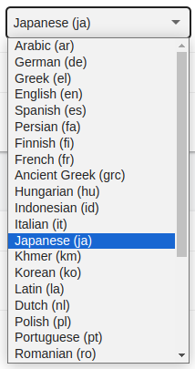
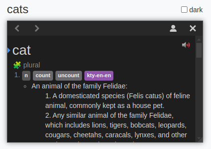
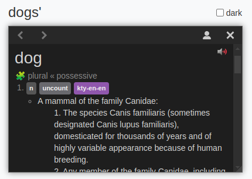

# Contributing to a Language

Improving Yomitan's features for the language(s) you are interested in is pretty simple, and a great way to help yourself and others. This guide will help you get started.

## Adding a Language



If your language is not already available in the Language dropdown, here is how you can add it with just a few lines. As an example, we'll use [PR #913](https://github.com/yomidevs/yomitan/pull/913/files), where a first-time contributor added Dutch.

```js
// language-descriptors.js
{
    iso: 'nl',
    iso639_3: 'nld',
    name: 'Dutch',
    exampleText: 'lezen',
    textPreprocessors: capitalizationPreprocessors
}
```

1. Look up the ISO 639-1 and ISO 639-3 codes for your language. If it is a rarer language it might not have a ISO-639-1 code - if that's the case, use ISO 639-3 for both `iso` and `iso639_3`.
2. Place your language in the `languageDescriptors` array in `language-descriptors.js`. The languages are sorted alphabetically by ISO code.
3. The example text is usually some form of the verb "to read" in your language, but it can be any example you feel is good. This will be shown in the preview popup on the settings page.
4. If your language uses the Latin or Cyrillic script, or another script with capitalization, you will want to use the `capitalizationPreprocessors`. We'll cover this part in more detail a bit later. The `textPreprocessors` field can also be left out.

When in doubt, look at the other languages in the file for ideas. The same applies to `language-descriptors.d.ts`:

```ts
// language-descriptors.d.ts
nl: {
  pre: CapitalizationPreprocessors;
}
```

This is just for some type safety. The first key is the ISO code. Most languages will then only have a `pre` key (the other one is `post`), and its value is the type of text preprocessors you used in `language-descriptors.js`. Use the TypeScript operator `&` as needed. If you didn't use any text preprocessors, you can set the value to `Record<string, never>`.

That's it! Your language should now be selectable from the dropdown, and may work perfectly fine already. If you don't already have a dictionary to test with, check out [Dictionaries](../dictionaries.md). For more advanced features, read on.

## Recommended Dictionaries

If you want to suggest to the user some dictionaries to download, you can make a pull request similar to:
https://github.com/yomidevs/yomitan/pull/1951/files

Please make sure you have permission to distribute these dictionaries legally.

## Language Features

You should first have the repo set up locally according to the instructions in the [contributing guidelines](../../CONTRIBUTING.md).

A language descriptor in `language-descriptors.js` has several optional fields for more advanced features. We've already mentioned `textPreprocessors`, but there are also `languageTransforms`, `textPostprocessors`, `isTextLookupWorthy`, and `readingNormalizer`. Let's go through them (see also the full type definition in `language-descriptors.d.ts`).

### Text Preprocessors

The scanned text may not exactly match the word in the dictionary. For example, an English dictionary will likely contain the word "read", but the text may contain "Read" or "READ". To handle cases like this, we use text preprocessors.

```ts
// from language.d.ts
export type TextProcessor<T = unknown> = {
  name: string;
  description: string;
  options: TextProcessorOptions<T>;
  process: TextProcessorFunction<T>;
};
```

Every text preprocessor has:

- A `name` and `description`
- An array of `options`, most commonly just `[false, true]`, that control the behavior of the `process` function.
- A `process` function that takes a string and a setting and returns a string

Here are the `CapitalizationPreprocessors` used in the Dutch example:

```js
/** @type {import('language').TextProcessor<boolean>} */
export const decapitalize = {
  name: "Decapitalize text",
  description: "CAPITALIZED TEXT → capitalized text",
  options: basicTextProcessorOptions, // [false, true]
  process: (str, setting) => (setting ? str.toLowerCase() : str),
};

/** @type {import('language').TextProcessor<boolean>} */
export const capitalizeFirstLetter = {
  name: "Capitalize first letter",
  description: "lowercase text → Lowercase text",
  options: basicTextProcessorOptions, // [false, true]
  process: (str, setting) =>
    setting ? str.charAt(0).toUpperCase() + str.slice(1) : str,
};
```

When applying preprocessors, each combination will be separately applied and looked up. Since each of these two preprocessors has two options, there are 2\*2=4 possible combinations. For the input string `reaD`, the following strings will be looked up:

- `reaD` (both preprocessors off)
- `ReaD` (only `capitalizeFirstLetter` on)
- `read` (only `decapitalize` on)
- `Read` (both preprocessors on)

Note that the order of text processors can matter. Had we put capitalizeFirstLetter before decapitalize, the 4th string would be `read` instead of `Read`.

#### Letter Variants

A letter or a group of letters may have multiple variants in a language. For example, in German, "ß" can be written as "ss" and vice versa, or in Japanese every kana has a hiragana and a katakana variant. To handle this, we use a bidirectional conversion preprocessor.

```js
// from german-text-preprocessors.js
/** @type {import('language').BidirectionalConversionPreprocessor} */
export const eszettPreprocessor = {
  name: 'Convert "ß" to "ss"',
  description: "ß → ss, ẞ → SS and vice versa",
  options: ["off", "direct", "inverse"],
  process: (str, setting) => {
    switch (setting) {
      case "off":
        return str;
      case "direct":
        return str.replace(/ẞ/g, "SS").replace(/ß/g, "ss");
      case "inverse":
        return str.replace(/SS/g, "ẞ").replace(/ss/g, "ß");
    }
  },
};
```

These have three options: off, direct, and inverse, and the `process` function must handle each of them.

#### Removing Diacritics

In some cases (e.g. German umlauts), diacritics are near-ubiquitous. However some languages (such as Latin, Arabic etc) do not commonly use diacritics, but only in specific kinds of texts (e.g dictionaries, texts for children or learners). In these cases, the dictionaries that Yomitan uses will likely not contain diacritics, but the text may contain them. To handle this, we use a diacritics removal preprocessor.

This kind of text processing is to a degree interdependent with the dictionaries available for the language.

### Deinflection Rules (a.k.a. Language Transforms)



Deinflection is the process of converting a word to its base or dictionary form. For example, "running" should be deinflected to "run". This is useful for finding the word in the dictionary, as well as helping the user understand the grammar (morphology) of the language.

These grammatical rules are located in files such as `english-transforms.js`. We recommend reading through this file as an example.

> Not all the grammatical rules of a language can or need to be implemented in the transforms file. Even a little bit goes a long way, and you can always add more rules later. For every couple rules you add, write some tests in the respective file ([see the writing tests section below](#writing-deinflection-tests)). This will help you verify that your rules are correct, and make sure nothing is accidentally broken along the way.

Transforms files should export a `LanguageTransformDescriptor`, which is then imported in `language-descriptors.js`.

```js
// from language-transformer.d.ts
export type LanguageTransformDescriptor<TCondition extends string = string> = {
    language: string;
    conditions: ConditionMapObject<TCondition>;
    transforms: TransformMapObject<TCondition>;
};

export type ConditionMapObject<TCondition extends string> = {
    [type in TCondition]: Condition;
};

export type TransformMapObject<TCondition> = {
    [name: string]: Transform<TCondition>;
};

```

- `language` is the ISO code of the language
- `conditions` are an object containing parts of speech and grammatical forms that are used to check which deinflections should execute. They are referenced by the deinflection rules.
- `transforms` are the actual deinflection rules
- `TCondition` is an optional generic parameter that can be passed to `LanguageTransformDescriptor`. You can learn more about it at the end of this section.

Let's try and write a bit of deinflection for English, from scratch.

```js
// english-transforms.js
import { suffixInflection } from "../language-transforms.js";

export const englishTransforms = {
  language: "en",
  conditions: {},
  transforms: {
    plural: {
      name: "plural",
      description: "Plural form of a noun",
      rules: [suffixInflection("s", "", [], [])],
    },
  },
};
```

This is a simple example for English, where the only deinflection rule is to remove the "s" from the end of a noun to get the singular form. The `suffixInflection` function is a helper that creates a deinflection rule for a suffix. It takes the suffix to remove, what to replace it with, and two more parameters for conditions, which we will look at next. The `suffixInflection` is the most common type of deinflection rule across languages. The inner `plural` is the displayed description while looking up, and the outer `plural` is a name only to be referenced internally within the file.

For the input string "cats", the following strings will be looked up:

- `cats` (no deinflection)
- `cat` (deinflected by the `plural` rule)

If the dictionary contains an entry for `cat`, it will successfully match the 2nd looked up string, (as shown in the image). Note the 🧩 symbol and the `plural` rule.

However, this rule will also match the word "reads", and show the verb "read" from the dictionary, marked as being `plural`. This makes no sense (e.g. "I have many reads" is not a sensible sentence), and we can use conditions to prevent it. Let's add a condition and use it in the rule.

```js
conditions: {
  n: {
    name: 'Noun',
    isDictionaryForm: true,
  },
},
transforms: {
  "plural": {
    name: "plural",
    description: "Plural form of a noun",
    rules: [
      suffixInflection("s", "", [], ["n"])
    ],
  },
},
```

Now, only dictionary entries marked with the same "n" condition will be eligible for matching the `plural` rule. The verb "read" should be marked as "v" in the dictionary, and will no longer be matched by the `plural` rule. The entries in the dictionary need to be marked with the exact same conditions defined in the `conditions` object. The `isDictionaryForm` field can be set to `false`, to allow some conditions to be used only in between rules, and not in the dictionary. In most cases however, it will be set to `true`.



Now consider the word `dogs'`, as in the `the dogs' bones`. This is the possessive of a plural noun. We can add a rule for the possessive:

```js
{
  name: "possessive",
  description: "Possessive form of a noun",
  rules: [
    suffixInflection("'", "", [], ["n"])
  ],
},
```

However, the only `conditionOut` of this rule, `n`, does not match any `conditionIn` of the `plural` rule, because the `plural` rules `conditionsIn` are an empty array. To fix this, we can add a condition to the `plural` rule:

```js
{
  name: "plural",
  description: "Plural form of a noun",
  rules: [
    suffixInflection("s", "", ["n"], ["n"])
  ],
},
```

Now the rules will chain together, as shown in the image. Chaining can be very useful (for agglutinative languages it is indispensable), but may cause unexpected behavior. For example, `boss` will now display results for the word `bo` (e.g. the staff) with the `plural` rule applied twice, i.e. it can chain with itself because the `conditionsIn` and `conditionsOut` are the same. This leads us to the actual implementation of the `plural` rule in `english-transforms.js`:

```js
conditions: {
  n: {
    name: "Noun",
    isDictionaryForm: true,
    subConditions: ["np", "ns"],
  },
  np: {
    name: "Noun plural",
    isDictionaryForm: true,
  },
  ns: {
    name: "Noun singular",
    isDictionaryForm: true,
  },
},
transforms: {
  "plural": {
    name: "plural",
    description: "Plural form of a noun",
    rules: [
      suffixInflection("s", "", ["np"], ["ns"])
    ],
  },
},
```

Since `ns` and `np` are subconditions of `n` they will both match with `n`, but not with each other. This covers all of the requirements we have considered.

The `suffixInflection` is one of a few helper functions - you can write more complex rules, using regex and a function for deinflecting. There are examples of this across the language transforms files.

#### Writing Deinflection Tests

Now that you have added a couple deinflection rules, you might want to start writing some tests to check if the deinflections are behaving correctly. Let's say we wanted to test the behavior of our `plural` and `possessive` rules and even them combined. Our test file should look like this:

```js
// english-transforms.test.js
import { englishTransforms } from "../../ext/js/language/en/english-transforms.js";
import { LanguageTransformer } from "../../ext/js/language/language-transformer.js";
import { testLanguageTransformer } from "../fixtures/language-transformer-test.js";

const tests = [
  {
    category: "plurals and possessive",
    valid: true,
    tests: [
      { term: "cat", source: "cats", rule: "ns", reasons: ["plural"] },
      { term: "cat", source: "cat's", rule: "ns", reasons: ["possessive"] },
      {
        term: "cat",
        source: "cats'",
        rule: "ns",
        reasons: ["plural", "possessive"],
      },
    ],
  },
];

const languageTransformer = new LanguageTransformer();
languageTransformer.addDescriptor(englishTransforms);
testLanguageTransformer(languageTransformer, tests);
```

The part we want to examine is the `test` array. The other things are common across all test files.

- `term` is the final form of the deinflected word.
- `source` is the source word to be deinflected to `term`.
- `rule` is the final condition of `term`. Here, we used `ns` because `cat` is a singular noun.
- `reasons` represents the chain of deinflection rules needed to get from `source` to `term`.

You can check that all the tests pass by running `npm run test:unit`.

> This command runs all Yomitan unit test files. To only run a single test file, you can instead opt for `npx vitest <file-name>`.

Now, we may want to verify that `boss` really does not deinflect to `bo`. You can add to the `tests` array:

```js
{
    category: 'invalid deinflections',
    valid: false,
    tests: [
        {term: 'boss', source: 'bo', rule: 'ns', reasons: ['plural', 'plural']},
    ],
},
```

Here, by setting `valid` to `false`, we are telling the test function to fail this test case if only `boss` deinflects to `bo` with the `ns` condition under a double `plural` rule.

You can also optionally pass a `preprocess` helper function to `testLanguageTransformer`. Refer to the language transforms test files for its specific use case.

#### Testing manually

If you want to test manually, make sure to reload the extension between changes to reflect your code changes. See the [CONTRIBUTING.md](../../CONTRIBUTING.md#loading-an-unpacked-build-into-chromium-browsers) doc for more info.

#### Opting in autocompletion

If you want additional type-checking and autocompletion when writing your deinflection rules, you can add them with just a few extra lines of code. Due to the limitations of TypeScript and JSDoc annotations, we will have to perform some type magic in our transformations file, but you don't need to understand what they mean in detail.

Your `english-transforms.js` file should look like this:

```js
// english-transforms.js
import { suffixInflection } from "../language-transforms.js";

/** @type {import('language-transformer').LanguageTransformDescriptor} */
export const englishTransforms = {
  language: "en",
  conditions: {
    n: {
      name: "Noun",
      isDictionaryForm: true,
      subConditions: ["np", "ns"],
    },
    np: {
      name: "Noun plural",
      isDictionaryForm: true,
    },
    ns: {
      name: "Noun singular",
      isDictionaryForm: true,
    },
  },
  transforms: {
    // omitted
  },
};
```

To gain type-safety, we have to pass an additional `TCondition` type parameter to `LanguageTransformDescriptor`. (You can revisit its definition [at the top of this section](#deinflection-rules-aka-language-transforms))

The passed type value should be the union type of all conditions in our transforms. To find this value, we first need to move the `conditions` object outside of `englishTransforms` and extract its type by adding a `/** @typedef {keyof typeof conditions} Condition */` comment at the start of the file. Then, you just need to pass it to the `LanguageTransformDescriptor` type declaration like so:

```js
// english-transforms.js
import { suffixInflection } from "../language-transforms.js";

/** @typedef {keyof typeof conditions} Condition */

const conditions = {
  n: {
    name: "Noun",
    isDictionaryForm: true,
    subConditions: ["np", "ns"],
  },
  np: {
    name: "Noun plural",
    isDictionaryForm: true,
  },
  ns: {
    name: "Noun singular",
    isDictionaryForm: true,
  },
};

/** @type {import('language-transformer').LanguageTransformDescriptor<Condition>} */
export const englishTransforms = {
  language: "en",
  conditions,
  transforms: {
    // omitted
  },
};
```

Now you should be able to check for types whenever writing a deinflection rule.

### Text Postprocessors

In special cases, text may need to be modified after deinflection. These work exactly like text preprocessors, but are applied after deinflection. Currently, this is only used for Korean, where the Hangul text is disassembled into jamo during preprocessing, and so must be reassembled after deinflection.

### Text Lookup Worthiness

Some features include checking whether a string is possibly a word in the language. For example, trying to look up, in an English dictionary, a word written with non-Latin characters (e.g. "日本語") will never yield any results. To prevent unnecessary lookups, an `isTextLookupWorthy` function can be provided, otherwise all text will be looked up.

### Reading Normalizers

In certain languages, dictionary entries may contain readings as a key to read words, e.g. Kana for Japanese and Pinyin for Chinese. Sometimes, dictionaries may be inconsistent in how they store these readings, leading to the word entries often being split when looked up even though they share the same reading. In these cases, you can use a `readingNormalizer` function to normalize the readings to a common format.

## Stuck?

If you have any questions, please feel free to open a Discussion on GitHub, or find us on the [Yomitan Discord](https://discord.gg/YkQrXW6TXF).
