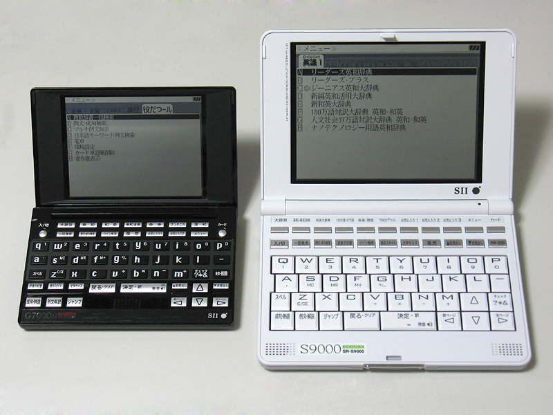

## Dictionaries

### Recommended Japanese Dictionaries

You must download and import the dictionaries you wish to use in order to enable Yomitan definition lookups. There are several free Japanese dictionaries available for Yomitan, some of them with glossaries available in different languages.

Be aware that non-English dictionaries contain fewer entries than their English counterparts. Even if your primary language is not English, you may consider also importing the English version for better coverage.

- [Jitendex](https://github.com/stephenmk/Jitendex) - Jitendex is an improved version of JMdict for Yomitan. It features better formatting and some other improvements, and is actively being improved by its author.
- [JMdict](https://github.com/themoeway/jmdict-yomitan#jmdict-for-yomitan-1) - There are daily automatically updated builds of JMdict for Yomitan available in this repository. It is available in multiple languages and formats, but we recommend installing the more modern Jitendex for English users.
- [JMnedict](https://github.com/themoeway/jmdict-yomitan#jmnedict-for-yomitan) - JMnedict is a dictionary that lists readings of person/place/organization names and other proper nouns.
- [KANJIDIC](https://github.com/themoeway/jmdict-yomitan#kanjidic-for-yomitan) - KANJIDIC is an English dictionary listing readings, meanings, and other info about kanji characters.

### More Dictionaries

There are many more dictionaries available in the Yomitan format. Some of them are listed in [Yomitan Dictionaries](https://github.com/MarvNC/yomichan-dictionaries). For guidelines on converting dictionaries, see [How Do I Make A Yomichan Dictionary](https://github.com/MarvNC/yomichan-dictionaries/blob/master/how-to-make-yomichan-dictionaries.md).

#### EPWING Dictionaries

Yomitan supports dictionaries in the esoteric but popular [EPWING](https://ja.wikipedia.org/wiki/EPWING) format. They were often utilized in portable electronic dictionaries similar to the ones pictured below. These dictionaries are often sought after by language learners for their correctness and excellent coverage of the Japanese language.

Unfortunately, as most of the dictionaries released in this format are proprietary, you will need to procure these dictionaries yourself and import them using [Yomitan Import](https://github.com/themoeway/yomitan-import). Check the project page for additional details.

### Bulk Importing Dictionaries

Yomitan also supports exporting and importing your entire collection of dictionaries.

#### Importing a Dictionary Collection

- Go to Yomitan's settings page (click on the extension's icon then click on the cog icon from the popup)
- Click `Import Dictionary Collection` and select the database file you want to import
- Wait for the import to finish then turn all the dictionaries back on from the `Dictionaries > Configure installed and enabled dictionaries` section
- Refresh the browser tab to see the dictionaries in effect

#### Exporting the Dictionary Collection

- Click `Export Dictionary Collection` from the backup section of Yomitan's settings page
- It will show you a progress report as it exports the data then initiates a
  download for a file named something like `yomitan-dictionaries-YYYY-MM-DD-HH-mm-ss.json`
  (e.g. `yomitan-dictionaries-2023-07-05-02-42-04.json`)

### Importing and Exporting Personal Configuration

Note that you can also similarly export and import your Yomitan settings from the `Backup` section of the Settings page.

You should be able to replicate your exact Yomitan setup across devices by exporting your settings and dictionary collection from the source device then importing those from the destination.
